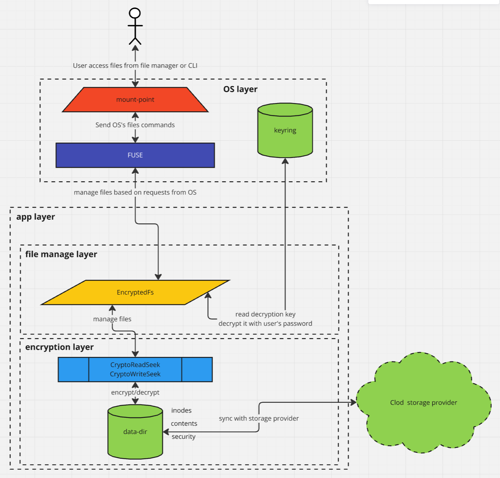

# rencfs

[](https://aur.archlinux.org/packages/rencfs-bin/)
[](https://crates.io/crates/rencfs)
[](https://docs.rs/rencfs/)
[](https://github.com/radumarias/rencfs/actions/workflows/build_and_tests.yml)
[](https://github.com/radumarias/rencfs/actions/workflows/release.yml)
[](https://codecov.io/gh/radumarias/rencfs)
<a href="https://join.slack.com/t/rencfs/shared_invite/zt-2o4l1tdkk-VJeWIbO2p6zgeafDISPHbQ"></a>
[](https://matrix.to/#/#rencfs:matrix.org)
[](https://discord.com/channels/1236855443486277653/1236855448515252306)
[](https://rencfs.zulipchat.com)
[](https://www.codetriage.com/radumarias/rencfs)

> [!WARNING]  
> **This crate hasn't been audited, it's using `ring` crate which is a well-known audited library, so in principle at
least the primitives should offer similar level of security.  
> This is still under development. Please do not use it with sensitive data for now, please wait for a
stable release.  
> It's mostly ideal for experimental and learning projects.**

An encrypted file system written in Rust that is mounted with FUSE on Linux. It can be used to create encrypted directories.

You can then safely backup the encrypted directory to an untrusted server without worrying about the data being exposed.
You can also store it in any cloud storage like Google Drive, Dropbox, etc. and have it synced across multiple devices.

You can use it as CLI or as a library to build your custom FUSE implementation or other apps that works with encrypted data.

# Motivation

Create a `simple`, `performant` yet `very secure` `encrypted filesystem` to protect your `privacy` which is also `open souce` and uses `well known audited` crates for `cryptograhic primitives`.

# A short story

[The Hitchhiker’s Guide to Building an Encrypted Filesystem in Rust](The_Hitchhiker_s_Guide_to_Building_an_Encrypted_Filesystem_in_Rust-1.pdf)

# Blog and tutorial

There will be a [series](https://medium.com/@xorio42/list/828492b94c23) of articles about the evolution of this project trying to keep it like a tutorial. This is the [first one](https://systemweakness.com/the-hitchhikers-guide-to-building-an-encrypted-filesystem-in-rust-4d678c57d65c).

# Crate of the week in [This Week in Rust](https://this-week-in-rust.org/)

It was [crate of the week](https://this-week-in-rust.org/blog/2024/08/14/this-week-in-rust-560/#crate-of-the-week) in Aug 2024.

# Key features

- `Security` using well-known audited `AEAD` cryptography primitives
- `Data integrity`, data is written with `WAL` to ensure integrity even on crash or power loss
- Hide all data for enhanced `privacy`, all metadata and content are encrypted
- Safe manage of `credentials` in memory with `mlock(2)`, `mprotect`, `zeroize` and `expiry`
- `Performance`, `memory safety` and `optimized` for `concurrency` with Rust
- Simplicity
- Encryption key generated based on password
- Password saved in OS's `keyring`
- `Change password` without re-encrypting all data
- `Fast seek` on both reads and writes
- `Writes in parallel`
- Exposed with `FUSE`
- Fully `concurrent` for all operations

# Functionality

- It keeps all `encrypted` data and `master encryption key` in a dedicated directory with files structured on `inodes` (with
  metadata info), files for binary content and directories with files/directories entries. All data, metadata and also filenames
  are encrypted. For new files it generates unique inodes in multi instance run and offline mode.
- The password is collected from CLI, and it's saved in OS `keyring` while app is running. This is because for safety reasons we
  clear the password from memory on inactivity, and we derive it again from password just when needed.
- Master encryption key is also encrypted with another key derived from the password. This gives the ability to change
  the
  password without re-encrypting all data, we just `re-encrypt` the `master key`.
- Files are `encrypted` in `chunks` of `256KB`, so when making a change, we just re-encrypt that chunks.
- `Fast seek` on read and write, so if you're watching a movie, you can seek to any position, and that would be instant.
  This is because we can seek to particular chunk.
- Encryption key is `zeroize`d in mem on dispose and idle. Also, it's `mlock`ed while used to prevent being moved to swap. It's
  also `mprotect`ed while not in use.

In progress:

- Ensure file integrity by saving each change to WAL, so on crash or power loss on next start we apply the pending
  changes. This makes the write operations atomic.
- Multiple writes in parallel to the same file, ideal for torrent like applications.

[](website/resources/layers.png)

# Stack

- it's fully async built upon [tokio](https://crates.io/crates/tokio) and [fuse3](https://crates.io/crates/fuse3)
- [ring](https://crates.io/crates/ring) for encryption and [argon2](https://crates.io/crates/argon2) for() key derivation
  function (creating key used to encrypt the master encryption key from password)
- [rand_chacha](https://crates.io/crates/rand_chacha) for random generators
- [secrecy](https://crates.io/crates/secrecy) for keeping pass and encryption keys safe in memory and zeroing them when
  not used. It keeps encryption keys in memory only while being used, and when not active it will release and zeroing
  them in memory
- [blake3](https://crates.io/crates/blake3) for hashing
- password saved in OS keyring using [keyring](https://crates.io/crates/keyring)
- [tracing](https://crates.io/crates/tracing) for logs

# Alternatives

- [Alternatives](https://www.libhunt.com/r/rencfs)
- [Alternatives](https://alternativeto.net/software/encfs/) to `EncFS`
- [VeraCrypt](https://www.veracrypt.fr/code/VeraCrypt/?h=NewSysEncWizard)
- [Cryptomator](https://cryptomator.org/)
- [TrueCrypt](https://truecrypt.sourceforge.net/)
- [DroidFS, F-Droid](https://f-droid.org/en/packages/sushi.hardcore.droidfs/)
- [LUKS, dm-crypt](https://guardianproject.info/archive/luks/)
- [AES Crypt](https://www.aescrypt.com/)
- [Windows BitLocker](https://learn.microsoft.com/en-us/windows/security/operating-system-security/data-protection/bitlocker/)
- [File Lock PEA](https://eck.cologne/peafactory/en/html/file_pea.html)
- [ZenCrypt](https://play.google.com/store/apps/details?id=com.zestas.cryptmyfiles&hl=en)
- [Hat.sh](https://hat.sh/)

## What separates us

- Advanced `security` using well-known audited `AEAD` cryptography primitives
- `Data integrity`, data is written with `WAL` to ensure integrity even on crash or power loss
- `Performance`, `memory safety` and `optimized` for `concurrency` with Rust
- Simplicity
- Hide all data for enhanced `privacy`, all metadata and content are encrypted
- Safe manage of `credentials` in memory with `mlock(2)`, `mprotect`, `zeroize` and `expiry`
- `Multi-platform`, on all platforms
- `Fast seek` on both reads and writes
- `Writes in parallel`
- Exposed with `FUSE`
- Fully open source
- Use it as a libraty to build your own apps
  
# Usage

<!---
## Give it a quick try with Run on Google Cloud

[](https://deploy.cloud.run)
-->

## Give it a quick try with Docker

Get the image

```bash
docker pull xorio42/rencfs
```

Start a container to set up mount in it

```bash
docker run -it --device /dev/fuse --cap-add SYS_ADMIN --security-opt apparmor:unconfined xorio42/rencfs:latest /bin/sh
```

In the container create mount and data directories

```bash
mkdir fsmnt && mkdir fsdata
```

Start `rencfs`

```bash
rencfs mount --mount-point fsmnt --data-dir fsdata
```

Enter a password for encryption.

Get the container ID

```bash
docker ps
```

In another terminal, attach to running container with the above ID

```bash
docker exec -it <ID> /bin/sh
```

From here you can play with it by creating files in `fsmnt` directory

```bash
cd fsmnt
mkdir 1
ls
echo "test" > 1/test
cat 1/test
```

## As a library

For the library, you can follow the [documentation](https://docs.rs/rencfs/latest/rencfs/).

## Command Line Tool

### Dependencies

To use the encrypted file system, you need to have FUSE installed on your system. You can install it by running the
following command (or based on your distribution).

Arch

```bash
sudo pacman -Syu && sudo pacman -S fuse3
```

Ubuntu

```bash
sudo apt-get update && sudo apt-get -y install fuse3
```

### Install from AUR

You can install the encrypted file system binary using the following command

```bash
yay -Syu && yay -S rencfs
```

### Install with cargo

You can install the encrypted file system binary using the following command

```bash
cargo install rencfs
```

A basic example of how to use the encrypted file system is shown below

```
rencfs mount --mount-point MOUNT_POINT --data-dir DATA_DIR
```

- `MOUNT_POINT` act as a client, and mount FUSE at the given path
- `DATA_DIR` where to store the encrypted data
  with the sync provider. But it needs to be on the same filesystem as the data-dir

It will prompt you to enter a password to encrypt/decrypt the data.

### Change Password

The master encryption key is stored in a file and encrypted with a key derived from the password.
This offers the possibility to change the password without needing to re-encrypt the whole data. This is done by
decrypting the master key with the old password and re-encrypting it with the new password.

To change the password, you can run the following command

```bash
rencfs passwd --data-dir DATA_DIR 
```

`DATA_DIR` where the encrypted data is stored

It will prompt you to enter the old password and then the new password.

### Encryption info

You can specify the encryption algorithm adding this argument to the command line

```bash
--cipher CIPHER ...
```

Where `CIPHER` is the encryption algorithm. You can check the available ciphers with `rencfs --help`.  
Default value is `ChaCha20Poly1305`.

### Log level

You can specify the log level adding the `--log-level` argument to the command line. Possible
values: `TRACE`, `DEBUG`, `INFO` (default), `WARN`, `ERROR`.

```bash
rencfs --log-level LEVEL ...
```

## Use it in Rust

You can see more [here](https://crates.io/crates/rencfs)

# Build from source

## Browser

[](https://gitpod.io/#https://github.com/radumarias/rencfs)

[](https://github.com/codespaces/new/?repo=radumarias%2Frencfs&ref=main)

You can compile it, run it, and give it a quick try in browser. After you start it from above

```bash
sudo apt-get update && sudo apt-get install fuse3
curl --proto '=https' --tlsv1.2 -sSf https://sh.rustup.rs | sh
mkdir mnt && mkdir data
cargo run --release -- mount -m mnt -d data
```

Open another terminal

```bash
cd mnt
mkdir a && cd a
echo "test" > test.txt
cat test.txt
```

## Locally

For now the `FUSE` (`fuse3` crate) only works on `Linux`, so to start the project you will need to be on Linux. 
Instead, you can [Develop inside a Container](#developing-inside-a-container), which will start a local Linux container, the IDE will connect to it, 
you can build and start the app in there and also use terminal to test it.

### Getting the sources

```bash
git clone git@github.com:radumarias/rencfs.git && cd rencfs
````

### Dependencies

#### Rust

To build from source, you need to have Rust installed, you can see more details on how to install
it [here](https://www.rust-lang.org/tools/install).

```bash
curl --proto '=https' --tlsv1.2 -sSf https://sh.rustup.rs | sh
````

Accordingly, it is customary for Rust developers to include this directory in their `PATH` environment variable.
During installation `rustup` will attempt to configure the `PATH`. Because of differences between platforms, command
shells,
and bugs in `rustup`, the modifications to `PATH` may not take effect until the console is restarted, or the user is
logged out, or it may not succeed at all.

If, after installation, running `rustc --version` in the console fails, this is the most likely reason.
In that case please add it to the `PATH` manually.

Project is setup to use `nightly` toolchain in `rust-toolchain.toml`, on first build you will see it fetch the nightly.

```bash
cargo install cargo-aur
cargo install cargo-generate-rpm
```

### Other dependencies

Also, these deps are required (or based on your distribution):

#### Arch

```bash
sudo pacman -Syu && sudo pacman -S fuse3 base-devel
```

#### Ubuntu

```bash
sudo apt-get update && sudo apt-get install fuse3 build-essential
```

#### Fedora

```bash
sudo dnf update && sudo dnf install fuse3 && dnf install @development-tools
```

### Build for debug

```bash
cargo build
```

### Build release

```bash
cargo build --release
```

### Run

```bash
cargo run --release -- mount --mount-point MOUNT_POINT --data-dir DATA_DIR
```

#### Dev settings

If you don't want to be prompted for password, you can set this env var and run like this:

```bash
RENCFS_PASSWORD=PASS cargo run --release -- mount --mount-point MOUNT_POINT --data-dir DATA_DIR
```

For dev mode is recommended to run with `DEBUG` log level:

```bash
cargo run --release -- --log-level DEBUG mount --mount-point MOUNT_POINT --data-dir DATA_DIR
```

### Build local RPM for Fedora

This is using [cargo-generate-rpm](https://crates.io/crates/cargo-generate-rpm)

```bash
cargo install cargo-generate-rpm
cargo build --release
cargo generate-rpm
```

The generated RPM will be located here: `target/generate-rpm`.

#### Install and run local RPM

```bash
cd target/generate-rpm/
sudo dnf localinstall rencfs-xxx.x86_64.rpm
```

## Developing inside a Container

See here how to configure for [RustRover](https://www.jetbrains.com/help/rust/connect-to-devcontainer.html) and for [VsCode](https://code.visualstudio.com/docs/devcontainers/containers).

You can use the `.devcontainer` directory from the project to start a container with all the necessary tools to build
and run the app.

# Minimum Supported Rust Version (MSRV)

The minimum supported version is `1.75`.

# Future

- Plan is to implement it also on macOS and Windows
- **Systemd service** is being worked on [rencfs-daemon](https://github.com/radumarias/rencfs-daemon)
- **GUI** is being worked on [rencfs-desktop](https://github.com/radumarias/rencfs-desktop) and [rencfs-kotlin](https://github.com/radumarias/rencfs-kotlin)
- **Mobile apps** for **Android** and **iOS** are being worked on [rencfs-kotlin](https://github.com/radumarias/rencfs-kotlin)

# Performance

`Aes256Gcm` is slightly faster than `ChaCha20Poly1305` by a factor of **1.28** on average. This is because of the hardware acceleration of AES 
on most CPUs via AES-NI. But where hardware acceleration is not available `ChaCha20Poly1305` is faster. Also `ChaChaPoly1305` is better at `SIMD`.

# Cipher comparison

## AES-GCM vs. ChaCha20-Poly1305

- If you have hardware acceleration (e.g. `AES-NI`), then `AES-GCM` provides better performance. On my benchmarks, it was
  faster by a factor of **1.28** on average.  
  If you do not have a hardware acceleration, `AES-GCM` is either slower than `ChaCha20-Poly1305`, or it leaks your
  encryption
  keys in cache timing.
- `AES-GCM` can target multiple security levels (`128-bit`, `192-bit`, `256-bit`), whereas `ChaCha20-Poly1305` is only defined at
  the `256-bit` security level.
- Nonce size:
    - `AES-GCM`: Varies, but the standard is `96 bits` (`12 bytes`).
      If you supply a longer nonce, this gets hashed down to `16 bytes`.
    - `ChaCha20-Poly1305`: The standardized version uses `96-bit` nonce (`12 bytes`), but the original used `64-bit`
      nonce (`8 bytes`).
- Wear-out of a single (key, nonce) pair:
    - `AES-GCM`: Messages must be less than `2^32 – 2` blocks (a.k.a. `2^36 – 32 bytes`, a.k.a. `2^39 – 256 bits`), that's
      roughly `64GB`.
      This also makes the security analysis of `AES-GCM` with long nonces complicated, since the hashed nonce doesn’t
      start
      with the lower `4 bytes` set to `00 00 00 02`.
    - `ChaCha20-Poly1305`: `ChaCha` has an internal counter (`32 bits` in the standardized IETF variant, `64 bits` in the
      original design). Max message length is `2^39 - 256 bits`, about `256GB`
- Neither algorithm is **nonce misuse-resistant**.
- `ChaChaPoly1305` is better at `SIMD`

### Conclusion

Both are good options. `AES-GCM` can be faster with **hardware support**, but **pure-software** implementations of
`ChaCha20-Poly1305` are almost always **fast** and **constant-time**.

# Security

- **Phantom reads**: reading older content from a file, this is not possible. Data is written with WAL and periodically
  flushed to file. This ensures data integrity and maintains change order.
  One problem that may occur is if we do a truncate we change the content of the file, but the process is killed before
  we write the metadata with the new filesize. In this case, next time we mount the system, we are still seeing the old
  filesize. However, the content of the file could be bigger, and we read until the old size offset, so we would not
  pick up
  the new zeros bytes written on truncating by increasing the size. If content is smaller the read would stop and
  end-of-file of the actual content, so this would not be such a big issue
- **What kind of metadata does it leak**: close to none. The filename, actual file size and other file attrs (times,
  permissions, other flags) are kept encrypted. What it could possibly leak is the following
    - If a directory has children, we keep those children in a directory with name as inode number with encrypted names
      of children as files in it.
      So we could see how many children a directory has.
      However, we can't identify that actual directory name,
      we can just see its inode number (internal representation like an id for each file), and we cannot see the actual
      filenames of directory or children.
      Also, we cannot identify which file content corresponds to a directory child
    - Each file content is saved in a separate file, so we could see the size of the encrypted content, but not the
      actual filesize
    - We can also see the last time the file was accessed
- It's always recommended to use encrypted disks for at least your sensitive data, this project is not a replacement for
  that
- To reduce the risk of encryption key from being exposed from memory, it's recommended to disable memory dumps on the
  OS level. Please see [here](https://www.cyberciti.biz/faq/disable-core-dumps-in-linux-with-systemd-sysctl/) how to do
  it on Linux
- **Cold boot attacks**: to reduce the risk of this, we keep the encryption key in memory just as long as we really
  need it to encrypt/decrypt data, and we are zeroing it after that. We also remove it from memory after a period of
  inactivity
- Please note this project was not audited by any security expert. It's built with security in mind and tries to
  follow all the best practices, but it's not guaranteed to be secure
- **Also, please back up your data, the project is still in development, and there might be bugs that can lead to data
  loss**

# Considerations

- Please note, this project doesn't try to reinvent the wheel or be better than already proven implementations
- This project doesn't want to be a replacement in any way of already proven file encryption solutions. If you really
  want close to bulletproof solutions, then maybe this is not the ideal one for you. But is trying to offer a simple use
  of an encryption solution that should be used taking into consideration all the security concerns from above
- It started as a learning project of Rust programming language, and I feel like keep building more on it
- It's a fairly simple and standard implementation that tries to respect all security standards, correcly use secure and robust
  primitives so that it can be extended from this. Indeed, it doesn't have the maturity yet to "fight" other well-known
  implementations.
  But it can be a project from which others can learn or build upon or why not for some to actually use it keeping in
  mind all the above

# Contribute

Feel free to fork it, change and use it in any way that you want. If you build something interesting and feel like sharing 
pull requests are always appreciated.

## How to contribute

Please see [CONTRIBUTING.md](CONTRIBUTING.md).
