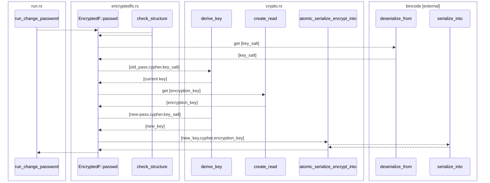

```mermaid
sequenceDiagram
    box run.rs 
        participant rn_chng_pass as run_change_password
    end

    box encryptedfs.rs
        participant encfs_passwd as EncryptedF::passwd
        participant chk_stucture as check_structure
    end

    box crypto.rs
        participant der_key as derive_key
        participant cr_read as create_read
        participant atomic_enc_ser as atomic_serialize_encrypt_into
    end

    box  bincode [external]
        participant des_from as deserialize_from
        participant ser_into as serialize_into
    end

    rn_chng_pass -->> encfs_passwd : 
    encfs_passwd --> chk_stucture : 
    chk_stucture -->> encfs_passwd : 
    encfs_passwd -->> des_from : get [key_salt]
    des_from -->> encfs_passwd : [key_salt]

    encfs_passwd -->> der_key : [old_pass,cypher,key_salt]
    der_key -->> encfs_passwd : [current key]

    encfs_passwd -->> cr_read:  get [encryption_key]
    cr_read -->> encfs_passwd: [encryption_key] 

    encfs_passwd --> der_key : [new-pass,cypher,key_salt]
    der_key -->> encfs_passwd : [new_key]

    encfs_passwd -->> atomic_enc_ser : [new_key,cypher,encryption_key]
    atomic_enc_ser -->> ser_into : 
    ser_into -->> atomic_enc_ser : 
    atomic_enc_ser -->> encfs_passwd : 
    encfs_passwd -->> rn_chng_pass : 
```
