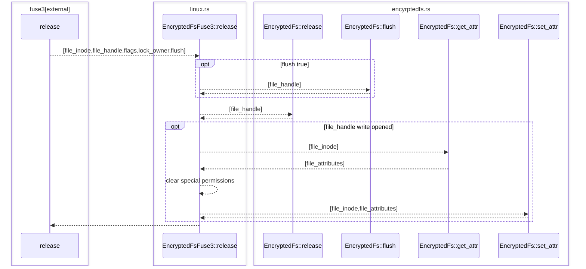

```mermaid
sequenceDiagram
    box fuse3[external]
        participant ext_release as release
    end 

    box linux.rs
        participant release as EncryptedFsFuse3::release
    end  

    box encyrptedfs.rs
        participant enc_release as EncryptedFs::release
        participant enc_flush as EncryptedFs::flush
        participant enc_getattr as EncryptedFs::get_attr
        participant enc_setattr as EncryptedFs::set_attr
    end  

    ext_release -->> release : [file_inode,file_handle,flags,lock_owner,flush]
    opt flush true
        release -->> enc_flush : [file_handle]
        enc_flush -->> release : 
    end
    release -->> enc_release : [file_handle]
    enc_release -->> release : 
    opt file_handle write opened
        release -->> enc_getattr : [file_inode]
        enc_getattr -->> release : [file_attributes]
        release -->> release : clear special permissions
        release -->> enc_setattr : [file_inode,file_attributes]
        enc_setattr -->> release : 
    end
    release -->> ext_release : 
```
