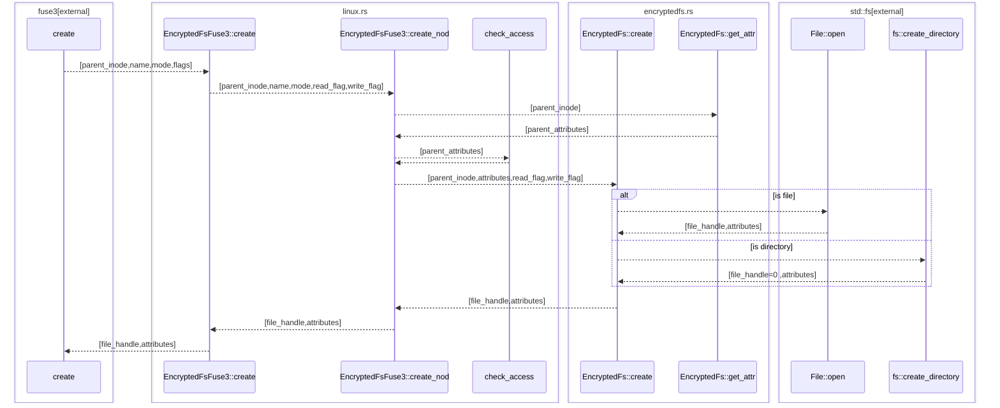

```mermaid
sequenceDiagram
    box fuse3[external]
        participant ext_create as create
    end

    box linux.rs
        participant lnx_create as EncryptedFsFuse3::create
        participant nod_create as EncryptedFsFuse3::create_nod
        participant chk_access as check_access 
    end

    box encryptedfs.rs
        participant enc_create as EncryptedFs::create
        participant get_attr as EncryptedFs::get_attr
    end

    box std::fs[external]
        participant file_open as File::open
        participant create_dir as fs::create_directory
    end


    ext_create -->> lnx_create : [parent_inode,name,mode,flags]
    lnx_create -->> nod_create : [parent_inode,name,mode,read_flag,write_flag]
    nod_create -->> get_attr : [parent_inode]
    get_attr -->> nod_create : [parent_attributes]
    nod_create -->> chk_access : [parent_attributes]
    chk_access -->> nod_create : 
    nod_create -->> enc_create : [parent_inode,attributes,read_flag,write_flag]
        alt is file 
            enc_create -->> file_open : 
            file_open -->> enc_create : [file_handle,attributes]
        else is directory
            enc_create -->> create_dir : 
            create_dir -->> enc_create : [file_handle=0 ,attributes]
        end
    enc_create -->> nod_create : [file_handle,attributes]
    nod_create -->> lnx_create : [file_handle,attributes]
    lnx_create -->> ext_create : [file_handle,attributes]

```
