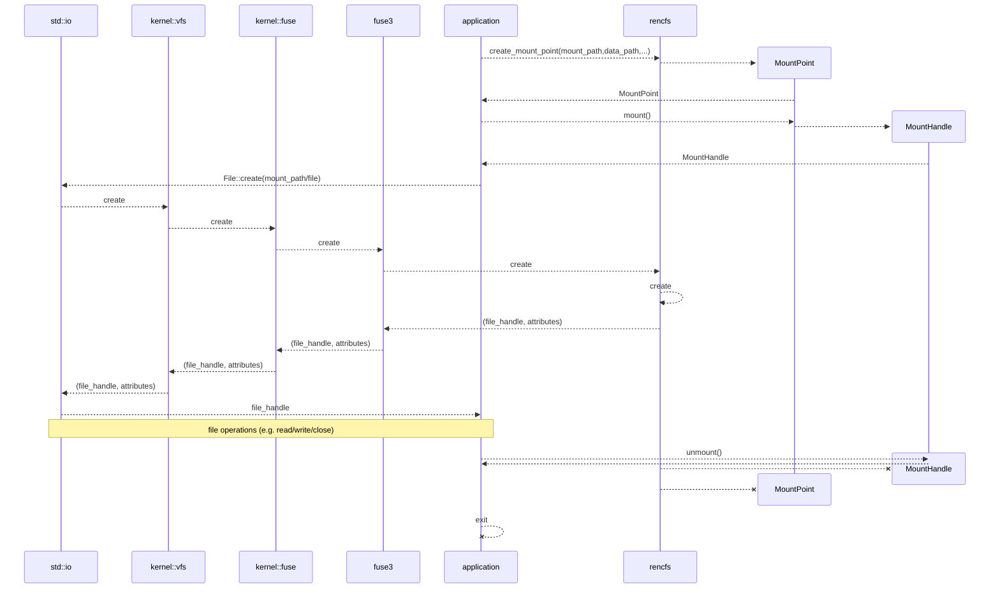

```mermaid
sequenceDiagram
    participant stdio as std::io
    participant vfs as kernel::vfs
    participant fuse as kernel::fuse
    participant fuse3 as fuse3
    application -->> rencfs : create_mount_point(mount_path,data_path,...)
    create participant MountPoint 
    rencfs -->> MountPoint : 
    MountPoint -->> application : MountPoint
    application -->> MountPoint : mount()
    create participant MountHandle 
    MountPoint -->> MountHandle : 
    MountHandle -->> application : MountHandle
    application -->> stdio : File::create(mount_path/file)
    stdio -->> vfs : create 
    vfs -->> fuse : create 
    fuse -->> fuse3 : create 
    fuse3 -->> rencfs : create
    rencfs -->> rencfs : create
    rencfs -->> fuse3 : (file_handle, attributes)
    fuse3 -->> fuse : (file_handle, attributes)
    fuse -->> vfs : (file_handle, attributes)
    vfs -->> stdio : (file_handle, attributes)
    stdio -->> application : file_handle
    Note over stdio,application :  file operations (e.g. read/write/close)
    application -->> MountHandle : unmount()
    MountHandle -->> application : 
    destroy MountHandle 
    rencfs --x MountHandle : 
    destroy MountPoint
    rencfs --x MountPoint : 
    application --x application : exit

```

Further details about the create sequence can be found in [Create](create_file.md).
