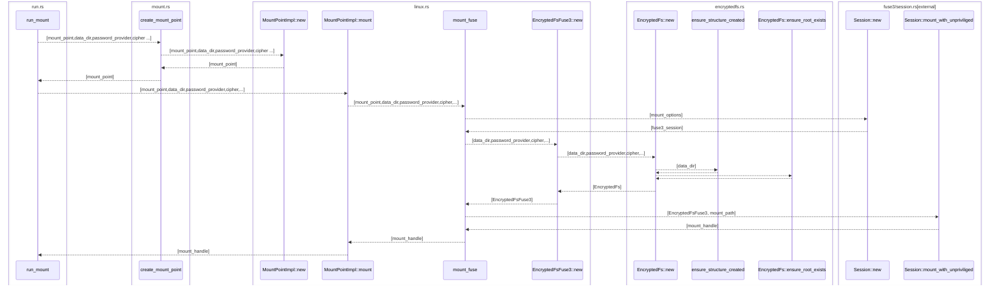

```mermaid
sequenceDiagram
    box run.rs
        participant rn_mnt as run_mount
    end
    
    box mount.rs
        participant cr_mp as create_mount_point
    end
    
    box linux.rs
        participant mnt_point_impl_new as MountPointImpl::new
        participant mnt_point_impl_mount as MountPointImpl::mount
        participant mnt_fuse as mount_fuse
        participant enc_fs_fuse3 as EncryptedFsFuse3::new
    end
    
    box encryptedfs.rs
        participant enc_fs as EncryptedFs::new
        participant ensure_fs_created as ensure_structure_created
        participant ensure_root as EncryptedFs::ensure_root_exists
    end

    box fuse3/session.rs[external]
        participant session_new as Session::new
        participant mnt_with_unpriv as Session::mount_with_unpriviliged
    end
    
    rn_mnt -->> cr_mp : [mount_point,data_dir,password_provider,cipher ...]
    cr_mp -->> mnt_point_impl_new : [mount_point,data_dir,password_provider,cipher ...]
    mnt_point_impl_new -->> cr_mp : [mount_point] 
    cr_mp -->> rn_mnt :  [mount_point]
    
    rn_mnt -->> mnt_point_impl_mount : [mount_point,data_dir,password_provider,cipher,...]  
    mnt_point_impl_mount -->> mnt_fuse: [mount_point,data_dir,password_provider,cipher,...]  
    mnt_fuse -->> session_new : [mount_options]
    session_new -->> mnt_fuse : [fuse3_session]  
    mnt_fuse -->> enc_fs_fuse3 : [data_dir,password_provider,cipher,...]
    enc_fs_fuse3 -->> enc_fs : [data_dir,password_provider,cipher,...] 
    enc_fs -->> ensure_fs_created :  [data_dir]
    
    ensure_fs_created -->> enc_fs :  
    enc_fs -->> ensure_root : 
    ensure_root -->> enc_fs :  
    
    enc_fs -->> enc_fs_fuse3 : [EncryptedFs]
    enc_fs_fuse3 -->> mnt_fuse : [EncryptedFsFuse3] 
    mnt_fuse -->> mnt_with_unpriv : [EncryptedFsFuse3, mount_path]
    mnt_with_unpriv -->> mnt_fuse:  [mount_handle]
    mnt_fuse -->> mnt_point_impl_mount : [mount_handle] 
    mnt_point_impl_mount -->> rn_mnt : [mount_handle]  

```
