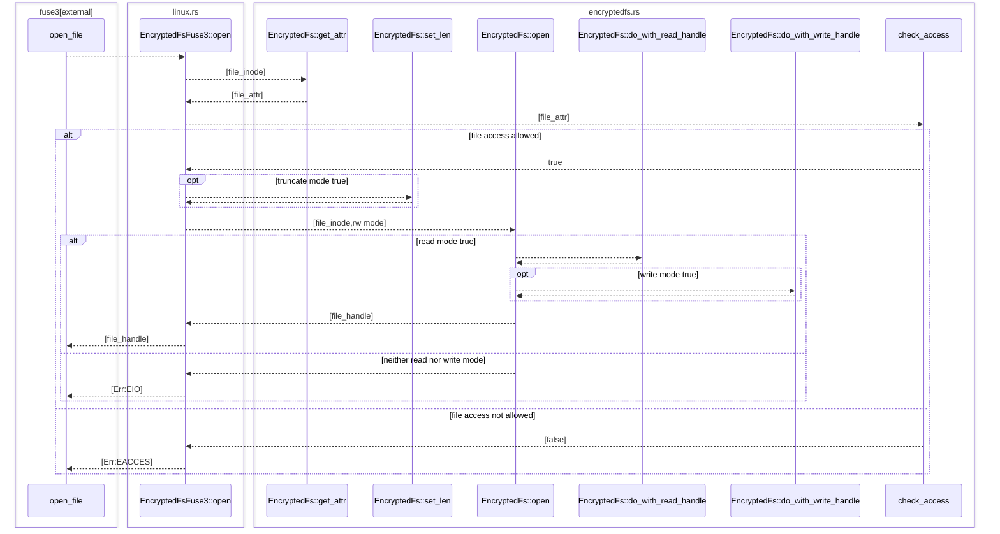

```mermaid
sequenceDiagram

    box fuse3[external]
        participant ext_open_file as open_file 
    end 

    box linux.rs 
        participant open_file as EncryptedFsFuse3::open 
    end 

    box encryptedfs.rs
        participant get_attr as EncryptedFs::get_attr 
        participant set_len as EncryptedFs::set_len 
        participant open as EncryptedFs::open 
        participant do_with_read as EncryptedFs::do_with_read_handle 
        participant do_with_write as EncryptedFs::do_with_write_handle 
        participant chk_acc as check_access 
    end 

    ext_open_file -->> open_file : 
    open_file -->> get_attr : [file_inode]
    get_attr -->> open_file : [file_attr]
    open_file -->> chk_acc : [file_attr]

    alt file access allowed
        chk_acc -->> open_file : true
        opt truncate mode true
            open_file -->> set_len : 
            set_len -->> open_file : 
        end
        open_file -->> open : [file_inode,rw mode]
        alt read mode true
            open -->> do_with_read : 
            do_with_read -->> open : 
            opt write mode true
                open -->> do_with_write : 
                do_with_write -->> open : 
            end
            open -->> open_file : [file_handle]
            open_file -->> ext_open_file : [file_handle]
        else neither read nor write mode
            open -->> open_file : 
            open_file -->> ext_open_file : [Err:EIO]
        end
    else file access not allowed
        chk_acc -->> open_file : [false]
        open_file -->> ext_open_file : [Err:EACCES]
    end
```
