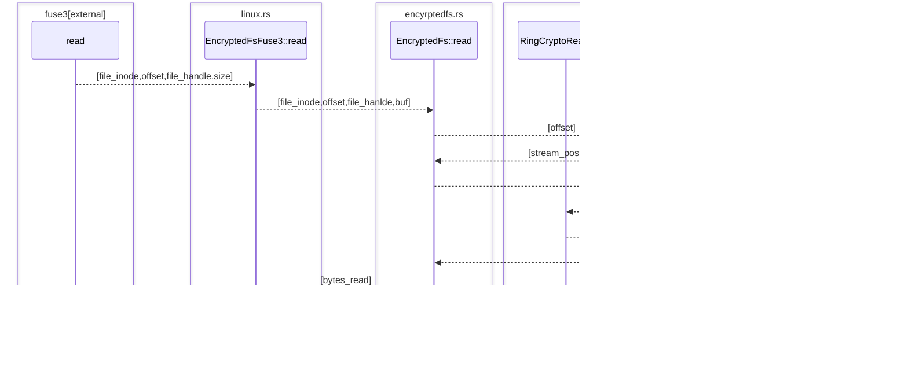

```mermaid
sequenceDiagram
    box fuse3[external]
        participant ext_read as read
    end 

    box linux.rs
        participant read as EncryptedFsFuse3::read
    end  

    box encyrptedfs.rs
        participant enc_read as EncryptedFs::read 
    end  

    box crypto/read.rs
        participant crypto_read as RingCryptoRead::read 
        participant crypto_seek as RingCryptoRead::seek
    end 

    box stream_util.rs
        participant su_read as read
    end 


ext_read -->> read : [file_inode,offset,file_handle,size]
read -->> enc_read : [file_inode,offset,file_hanlde,buf]
enc_read -->> crypto_seek : [offset]
crypto_seek -->> enc_read : [stream_position]
enc_read -->> su_read : [buf]
su_read -->> crypto_read : [buf]
crypto_read -->> su_read : [bytes_read]
su_read -->> enc_read : [bytes_read]
enc_read -->> read : [bytes_read]
read -->> ext_read : [buf]
```
