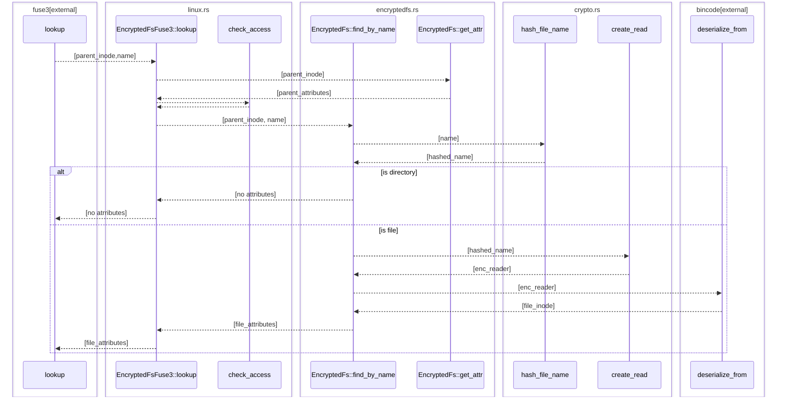

```mermaid
sequenceDiagram
    box fuse3[external]
        participant ext_search as lookup
    end

    box linux.rs
        participant lnx_search as EncryptedFsFuse3::lookup
        participant chk_access as check_access
    end

    box encryptedfs.rs
        participant enc_search as EncryptedFs::find_by_name
        participant get_attr as EncryptedFs::get_attr
    end

    box crypto.rs
        participant hash_fn as hash_file_name
        participant cr_read as create_read
        %% participant create_dir as fs::create_directory
    end

    box bincode[external]
        participant des_from as deserialize_from
    end 

    ext_search -->> lnx_search : [parent_inode,name]
    lnx_search -->> get_attr : [parent_inode]
    get_attr -->> lnx_search : [parent_attributes]
    lnx_search -->> chk_access : 
    chk_access -->> lnx_search : 
    lnx_search -->> enc_search : [parent_inode, name] 
    enc_search -->> hash_fn : [name]
    hash_fn -->> enc_search : [hashed_name]
    alt is directory
        enc_search -->> lnx_search : [no attributes]
        lnx_search -->> ext_search : [no atrributes]
    else is file
        enc_search -->> cr_read : [hashed_name]
        cr_read -->> enc_search : [enc_reader]
        enc_search -->> des_from : [enc_reader]
        des_from -->> enc_search : [file_inode]
        enc_search -->> lnx_search : [file_attributes]
        lnx_search -->> ext_search : [file_attributes]
    end
```
