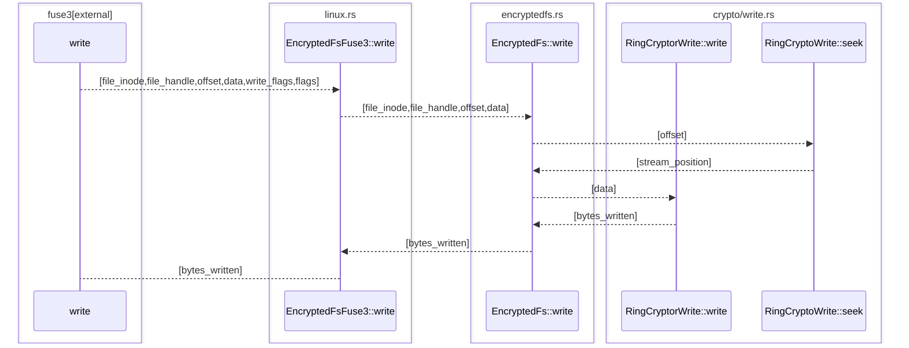

```mermaid
sequenceDiagram

    box fuse3[external]
        participant ext_write as write
    end

    box linux.rs
        participant write as EncryptedFsFuse3::write
    end

    box encryptedfs.rs
        participant enc_write as EncryptedFs::write
    end

    box crypto/write.rs
        participant crypto_write as RingCryptorWrite::write
        participant crypto_seek as RingCryptoWrite::seek
    end 


    ext_write -->> write : [file_inode,file_handle,offset,data,write_flags,flags]
    write -->> enc_write : [file_inode,file_handle,offset,data]
    enc_write -->> crypto_seek : [offset]
    crypto_seek -->> enc_write : [stream_position]
    enc_write -->> crypto_write : [data]
    crypto_write -->> enc_write : [bytes_written]
    enc_write -->> write : [bytes_written]
    write --> ext_write : [bytes_written]

```
